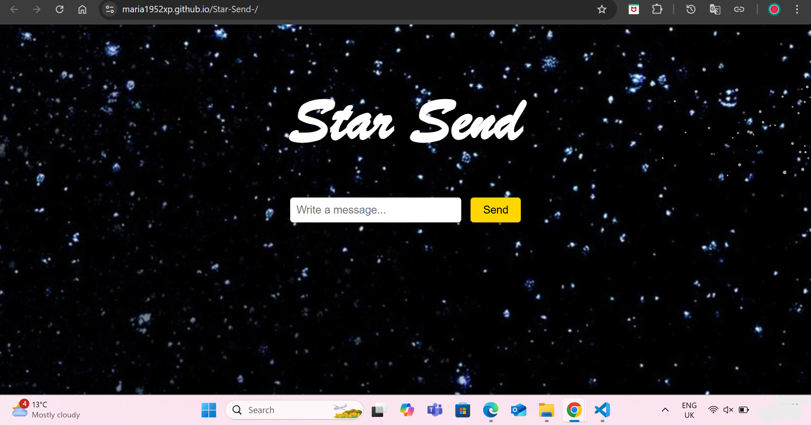

# Star Send

## 🌌 Project Overview
Star Send is more than just a web project—it is a digital sanctuary where emotions transcend space and time. Whether longing to connect with a loved one who has passed away or reaching out to someone no longer in contact, this project offers a symbolic way to send messages into the cosmos. Inspired by the belief that in many traditions, stars are believed to represent the souls or spirits of loved ones who have passed away, "Star Send" transforms heartfelt words into glowing celestial bodies that orbit infinitely in a serene galaxy. It is a way to honor memories, express unspoken words, and find comfort in the thought that our messages will always shine in the universe.

## 🎯 Features
- **Galaxy-Themed UI:** A visually stunning starry background.
- **Write & Send Messages:** Users can write messages that transform into glowing stars.
- **Animated Star Orbits:** Messages appear as stars that move in a circular orbit.
- **Hover to Reveal Messages:** Hovering over a star displays the message.
- **Local Storage Support:** Messages persist even after page refresh.

## 💡 Inspiration
The project is built on the sentimental belief that loved ones become stars in the sky. "Star Send" allows users to send their thoughts into a celestial space, offering a symbolic way to cherish memories.

## 🛠️ Tech Stack
- **HTML** - Structure of the webpage.
- **CSS** - Styling the galaxy background and animations.
- **JavaScript** - Handling interactions, animations, and local storage.

## 🚀 Installation & Usage
1. **Clone the Repository:**
   ```bash
   git clone https://maria1952xp.github.io/Star-Send-/
   ```
2. **Open the `index.html` file** in any modern browser.
3. **Start Sending Messages** to your loved ones, and watch them transform into stars! ✨

## 📸 Preview



## 🔮 Future Enhancements
- **Database Integration:** Store messages permanently.
- **User Authentication:** Personal star collections for users.
- **Audio & Visual Effects:** Enhance the immersive experience.

## 🎓 Scholarship Relevance
This project showcases my **passion for web development**, **creative problem-solving skills**, and **interest in interactive design**. It is a meaningful combination of **technology and emotions**, highlighting my ability to build innovative applications with user-centered design.

## 📬 Contact
If you have any questions or feedback, feel free to reach out:
- **Email:** maria.moju192@gmail.com
- **GitHub:** [maria1952xp](https://github.com/maria1952xp)

---
⭐ **If you like this project, consider giving it a star on GitHub!** ⭐

